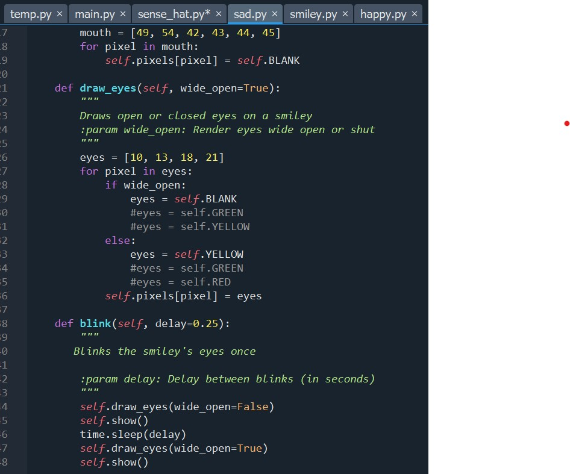
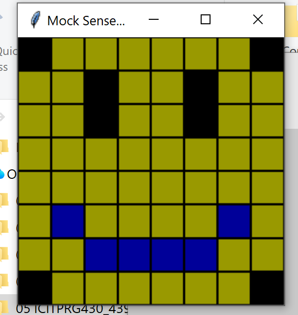

# Evidence and Knowledge

This document includes instructions and knowledge questions that must be completed to receive a *Competent* grade on this portfolio task.

## 1. Required evidence

### 1.1. Answer all questions in this document

- Each answer should be complete, well-articulated, and within the specified word count limits (if added) for each question.
- Please make sure **all** external sources are properly cited.
- You must **use your own words**. Please include your full chat transcripts if you use generative AI in any way.
- Generative AI hallucinates, is not an authoritative source

### 1.2. Make all the required modifications to the code

- Please follow the instructions in this document to make the changes needed to the code.

- When requested to upload evidence, upload all screenshots to `screenshots/` and embed them in this document. For example:

```markdown

```


> Note the `!`, and the use of a relative path.

- You must upload the code into your GitHub repository.
- While you can use a branch, your code should be in main when you submit.
- Upload a zip of this repository to Blackboard when you are ready to submit.
- You will be notified of your result via Blackboard
- However, if using GitHub classrooms, you may also receive additional feedback on GitHub directly

### 1.3. Optional: Use of Raspberry Pi and SenseHat

Raspberry Pi or SenseHat is **optional** for this activity. You can use the included `sense_hat.py` file to simulate the SenseHat on your computer.

If you use a Pi, please **delete** the `sense_hat.py` file.

### 1.4. Accessible version of the code

This project relies on visual patterns that appear on an LED matrix. If you have any accessibility requirements, you can use the `udl/accessible` branch to complete the project. This branch provides an accessible code version that uses text-based patterns instead of visual ones.

Please discuss this with your lecturer before using that branch.

## 2. Specific Tasks & Questions

Address the following tasks and questions based on the code provided in this repository.

### 2.1. Set up the project locally

1. Fork this repository (if not using GitHub Classrooms)
2. Clone your repository locally
3. Run the project locally by executing the `main.py` file
4. Evidence this by providing screenshots of the project directory structure and the output of the `main.py` file


If you are running on a Raspberry Pi, you can use the following command to run the project and then screenshot the result:

```bash
ls
python3 main.py
```

### 2.2. Fundamental code comprehension

 Answer each of the following questions **as they relate to that code** supplied by in this repository (ignore `sense_hat.py`):

1. Examine the code for the `smiley.py` file and provide  an example of a variable of each of the following types and their corresponding values (`_` should be replaced with the appropriate values):

   | Type                    | name                | value          |
   | ----------              | ----------          | -------------- |
   | built-in primitive type | Integrer, float     |  255           |
   | built-in composite type | tuple               |  (255,0,0)     |
   | user-defined type       | Class               |  Smiley        |

2. Fill in (`_`) the following table based on the code in `smiley.py`:

   | Object                   | Type                    |
   | ------------             | ----------------------- |
   | self.pixels              | list                    |
   | A member of self.pixels  | value                   |
   | self                     | instance                |

3. Examine the code for `smiley.py`, `sad.py`, and `happy.py`. Give an example of each of the following control structures using an example from **each** of these files. Include the first line and the line range:

   | Control Flow | File       | First line  | Line range  |
   | ------------ | ---------- | ----------- | ----------- |
   |  sequence    | smiley.py  | 35          | 35-39       |
   |  selection   | Sad.py     | 26          | 26-17       |
   |  iteration   | Happ.py    | 21          | 21-22       |

4. Though everything in Python is an object, it is sometimes said to have four "primitive" types. Examining the three files `smiley.py`, `sad.py`, and `happy.py`, identify which of the following types are used in any of these files, and give an example of each (use an example from the code, if applicable, otherwise provide an example of your own):

   | Type                    | Used? | Example |
   | ----------------------- | ----- | --------|
   | int                     | Y     | 255                                       |
   | float                   | Y     | 0.25                                      |
   | str                     | Y     | Provides a Smiley with a happy expression |
   | bool                    | Y     | True                                      |

5. Examining `smiley.py`, provide an example of a class variable and an instance variable (attribute). Explain **why** one is defined as a class variable and the other as an instance variable.

> WHITE - variable is Shared by all instances of the class
> Y - Unique to each instance(object) of the class

6. Examine `happy.py`, and identify the constructor (initializer) for the `Happy` class:
   1. What is the purpose of a constructor (in general) and this one (in particular)?

   > the constructor (__init__) is a special method called when a new oject in a class is setup. 
   > It sets up the  object by setting initial values for instance variables of steps.
   > In this instance it Renders a mouth and eyes by blanking the pixels that form that object.
   > mouth [41, 46, 50, 51, 52, 53]
   > eyes [10, 13, 18, 21]
   > This encapulates the setup logic inside the class so users Create a HAPPY and get ready to use it

   2. What statement(s) does it execute (consider the `super` call), and what is the result?

   > super.__init__() - as senseHat object is created and assigned to sense_hat. Turns on all LED's with the following LED off [0,7,56,64]
   > self.draw_mouth - Renders a mouth by blanking the pixels that form that object.  Turns of LED [41, 46, 50, 51, 52, 53]
   > self.draw_eyes - Draws the eyes (open by default) on the standard smiley. turns of LED's [10,13,18,21)

### 2.3. Code style

1. What code style is used in the code? Is it likely to be the same as the code style used in the SenseHat? Give to reasons as to why/why not:

> Python - PEP8 
> The  SensHat is primarly written in Python PEP8 however it uses a series of libraries  like the RTIMULib which are written in C/C++.
> Yes it is likely to be the same as written for use with Smiley.

2. List three aspects of this convention you see applied in the code.

> 4 -space indentation
> lowercase_with_underscores for functions and variables
> Function and variable names written in full
> Doc Strings for method explanations  Commented code to enable description of the purpose of the code sections
> CamelCase for class naming

3. Give two examples of organizational documentation in the code.

> Method docstring: """Renders a mouth by blanking the pixels that form that object.""" 
> Method docstring: """ Draws the eyes (open or closed) on the standard smiley. :param wide_open (bool): eyes open or closed."""

### 2.4. Identifying and understanding classes

> Note: Ignore the `sense_hat.py` file when answering the questions below

1. List all the classes you identified in the project. Indicate which classes are base classes and which are subclasses. For subclasses, identify all direct base classes.
  
  Use the following table for your answers:

| Class Name | Super or Sub? | Direct parent(s) |
| ---------- | ------------- | ---------------- |
| Smiley     | base          | no parent
| Sad        | Sub           | Smiley and Blinkable    |
| Happy      | Sub           | Smiley and Blinkable   | 
| Blinkable  | base          | no parent        | 
| SenseHat   | base          | no parent


2. Explain the concept of abstraction, giving an example from the project (note "implementing an ABC" is **not** in itself an example of abstraction). (Max 150 words)

> Abstraction: Hiding unneccsary detail and only showing what is essential to the user of the class or object.
> You don't need to know the engineering in the gearbox to know that it is changing gears and managing power transfer from the motor to the drive train. Just need to manage the selector (P,R,N,D)
> sense_hat provides abstraction of hardware behavior (mocking a Sense HAT).
>The inner workings of the SenseHat Class can be controlled with simple inputs of:
>mock_sense_hat = SenseHat()
>mock_sense_hat.set_pixels([(255, 0, 0)] * 64)
>mock_sense_hat.low_light = True
> The user can change pixels and toggle brightness — but they don’t see or deal with the complex inner workings.
> In the inner working detail, A multiprocessing.Process is created to run a GUI, Communication uses a queue to send pixel data between processes, The GUI uses tkinter Frames and colors, 
> Dim lighting mode involves adjusting each pixel’s RGB values, etc. 


3. What is the name of the process of deriving from base classes? What is its purpose in this project? (Max 150 words)

> Inheritance
> Inheritance allows a new class (called a subclass) to inherit attributes and methods from another class (called a parent/base class).
> In this project Sad and Happy which are ouputs on the LED display inherit the ability to change the LEd display from Smiley which inherits from SenseHat.
> Smiley sets the colour for each LED in the 64 LED array using intensity for each colour. It can dim the display and controls when the LED's display.
> SenseHat controls the workings of each LED as a Pixel. By turning pixels on and off, we can create a visual output that is changeable and customisable
> In short:Inheritance lets you build a new class that reuses, extends, or modifies the behavior of an existing class

### 2.5. Compare and contrast classes

Compare and contrast the classes Happy and Sad.

1. What is the key difference between the two classes?
   > Sad does not include the ability to blink. Because of this it does not need to import time and Blinkable 
   
2. What are the key similarities?
   > Both call the __init__ function from Smiley & both use the show function from Smiley
   > Both can call the dim_display function
   > Both draw a mouth
   > Both draw eyes
   
3. What difference stands out the most to you and why?
   > The code for the eyes is different, refer to code:  
 
   > 
4. How does this difference affect the functionality of these classes
   > The code in the Happy class (using Python's ternary conditional expression) opens the eyes afterwards
   > The code in the SAD class keeps the eyes closed.
   
### 2.6. Where is the Sense(Hat) in the code?

1. Which class(es) utilize the functionality of the SenseHat?
   > Smiley uses the functionality of the SenSense
   > Sad and Happy use the functionality of the SenSense through Smiley
   
2. Which of these classes directly interact with the SenseHat functionalities?
   > Smiley
   
3. Discuss the hiding of the SenseHAT in terms of encapsulation (100-200 Words)
   > Encapsulation is the hiding the detailed operation of something in something else. In this case the 
   > SenseHat is encapsulated in Smiley and we call Smiley for Happy and Sad and don't need to repeat the code in Happy and Sad. 
   > Complexity of SenseHat is hidden in Smiley.
   > Encapsulation in SenseHat class renders to the way the class hides its internal data and complex operations from direct access, exposing only what is necessary through controlled interfaces.
   > The class SenseHat class hides several internal attributes which are not meant to be accessed directly by the user (_low_light, queue and process) called from the multiprocessing 
   > The user can change LED colours and brightness without needing to know anything about queues, processes or Tkinter. This separation prevents accidental modification of critical internal          > states and ensures how the class works internally do no effect external code using it.
   > this design encapsulates all complexity within the class resulting in clean and simple interface.


### 2.7. Sad Smileys Can’t Blink (Or Can They?)

Unlike the `Happy` smiley, the current implementation of the `Sad` smiley does not possess the ability to blink. Let's first explore how blinking has been implemented in the Happy Smiley by examining the blink() method, which takes one argument that determines the duration of the blink.

**Understanding Blink Mechanism:**

1. Does the code's author believe that every `Smiley` should be able to blink? Explain.

> No, because they do not include the blinkable abstract class into Sad.  code that sits in Happy has Blinkable import from blinkable
>Sensehat
> |_Smiley
>    | ___Happy
>      | __blinkable
>      | __ blink
>    | ___sad
>    |

>  

2. For those smileys that blink, does the author expect them to blink in the same way? Explain.

> No, this is customisable for the classes that call smiley.
> The blink can change by using things like changes in colour.
>  
> 

3. Referring to the implementation of blink in the Happy and Sad Smiley classes, give a brief explanation of what polymorphism is.

> Polymorphism is a concept in programming where different classes can be treated as objects of a
> common superclass.  i.e “many forms”. It allows different classes to define methods with the same
> name but different behaviours, depending on the class that implements them 
> The same method can apply differently based on the object that is calling it.
> In the context of Happy and Sad classes, both may inherit from a common base class (smiley)  and
> each implements its own version of a method called blink(). When the blink() is called on an object
> python chooses the version that matches the object’s class.

4. How is inheritance used in the blink method, and why is it important for polymorphism?

> Inheritance is the concept of taking on a behaviour from a parent class. It is important with reference to polymorphism because some behaviours can be overwritten in the sub class.
> This allows methods like Blink to behave differently in the subclass.
> Even though both objects share the same method name, their behaviour differ – the sad face
> shows a different eye lid colour. 
> The ability to use a single interface (blink()) for different underlying implementations is what defines polymorphism.
> 


1. **Implement Blink in Sad Class:**

   - Create a new method called `blink` within the Sad class. Ensure you use the same method signature as in the Happy class:

   ```python
   def blink(self, delay=0.25):
       pass  # Replace 'pass' with your implementation
   ```

2. **Code Implementation:** Implement the code that allows the Sad smiley to blink. Use the implementation from the Happy Smiley as a reference. Ensure your new method functions similarly by controlling the blink duration through the `delay` argument.
3. 

4. **Testing the Implementation:**

- Test the new blink functionality on your Raspberry Pi or within the Python classes provided. You might need to adjust the `main.py` script to incorporate Sad Smiley's new blinking capability.

Include a screenshot of the sad smiley or the modified `main.py`:


- Observe and document the Sad smiley as it blinks its eyes. Describe any adjustments or issues encountered during implementation.

  > I was able to change the color of the eye lid during the blink by changing the colour of the else statement in the code above
  > When we turned of blink (which we copied in above), the code left the eyes shut and did not open again.
  

  ### 2.8. If It Walks Like a Duck…

  Previously, you implemented the blink functionality for the Sad smiley without utilizing the class `Blinkable`. Assuming you did not use `Blinkable` (even if you actually did), consider how the Sad smiley could blink similarly to the Happy smiley without this specific class.

  1. **Class Type Analysis:** What kind of class is `Blinkable`? Inspect its superclass for clues about its classification.

     > Blinkable is suppposed to be an abstract class. I.e. anything that inherits Blinkable, must provide its own implemtnation of blink()
     > An abstract base class serves as a template for other classes.
     > It cannot be instantiated directly, and it defines methods (often marked with @abstractmethod) that must be implemented by any subclass.
     >  Any subclass of Blinkable (e.g., HappySmiley, SadSmiley) must provide its own implementation of the blink() method.

  2. **Class Implementation:** `Blinkable` is a class intended to be implemented by other classes. What generic term describes this kind of class, which is designed for implementation by others? **Clue**: Notice the lack of any concrete implementation and the naming convention.

     >  The generic term for blinkable is an interface. A class that defines behaviour but does not implement it. i.e. It is designed to be implemented by other classes and contains no concrete implementation.
     > An interface defines a contract — a set of methods that other classes must implement, but it doesn’t specify how they should do it.
     > When SAD implements blink(), it furfills that contract

  3. **OO Principle Identification:** Regarding your answer to question (2), which Object-Oriented (OO) principle does this represent? Choose from the following and justify your answer in 1-2 sentences: Abstraction, Polymorphism, Inheritance, Encapsulation.

  > Abstraction - 
  > Polymorphism - many forms ( the blink functionality occurs  is customised in Sad and Happy).
  > the blinkable class demonstrates the Object oriented principl of polymorphism thorugh abstraction

  4. **Implementation Flexibility:** Explain why you could grant the Sad Smiley a blinking feature similar to the Happy Smiley's implementation, even without directly using `Blinkable`.

  > The blink() method os a sequence of steps by: drawing eyes closed, displaying it, waiting, drawings eyes open, displaying again.
  > We have inherited the ability to blink through Smiley which inherits from SenseHat. We just need to import time to enable the code to blink.
  > You can code this into sad so that Sad behaviour is different from Happy in happy. i.e. two blinks instead of one.
  
  > Sad automatically inhereted the attributes and methods from Smiley (self.pixels, self.show(), self.White,self.Yellow,Self.Blank) so we have the building blocks to blink. You don;t need blankable to access the display logic.
  
  5. **Concept and Language Specificity:** In relation to your response to question (4), what is this capability known as, and why is it feasible in Python and many other dynamically typed languages but not in most statically typed programming languages like C#? **Clue** This concept is hinted at in the title of this section.

  > Your answer here

  ***

  ## 3. Refactoring

  ### 3.1. Does a Smiley Have to Be Yellow?

  While our current implementation predominantly features yellow smileys, emotional expressions like sickness or anger typically utilize colors like green, red, or orange. We'll explore the feasibility of integrating these colors into our smileys.

  1. **Defined Colors and Their Location:**

     1. Which colors are defined and in which class(s)?
        > The folloowing colours are deinfed in the class Smiley
        > WHITE = (255, 255, 255)
        > GREEN = (0, 255, 0)
        > RED = (255, 0, 0)
        > YELLOW = (255, 255, 0)
        > BLANK = (0, 0, 0)Your answer here
         The SenseHat Class also sets some colours.
         
     2. What type of variables hold these colors? Are the values expected to change during the program's execution? Explain your answer.
        > The variables WHITE,GREEN,RED,YELLOW,BLANK are class variables because they are shared by all instances of the class
        > the values are stored in a tuple and are not expected to change( i.e. tuples do not change)
                
     3. Add the color blue to the appropriate class using the appropriate format and values.
        > Added blue smile to Happy
  
  
        
  2. **Usage of Color Variables:**

     1. In which classes are the color variables used?
        > Smiley
        > Happy
        > Sad
        > SenseHat

  3. **Simple Method to Change Colors:**
  4. What is the easiest way you can think to change the smileys to green? Easiest, not necessarily the best!
     > Change in Smiley
     > 
     >  


  ### 3.2. Flexible Colors – Step 1

  Changing the color of the smileys once is straightforward, but it isn't very flexible. To facilitate various colors for smileys, it is advisable not to hardcode values in any class. This approach was identified earlier as a necessary change. Let's start by removing the built-in assumptions about color in our classes.

  1. **Add a method called `complexion` to the `Smiley` class:** Implement this instance method to return `self.YELLOW`. Using the term "complexion" instead of "color" provides a more abstract terminology that focuses on the meaning rather than implementation.

  2. **Refactor subclasses to use the `complexion` method:** Modify any subclass that directly accesses the color variable to instead utilize the new `complexion` method. This ensures that color handling is centralized and can be easily modified in the future.

  3. **Determine the applicable Object-Oriented principle:** Consider whether Abstraction, Polymorphism, Inheritance, or Encapsulation best applies to the modifications made in this step.

  4. **Verify the implementation:** Ensure that the modifications function as expected. The smileys should still display in yellow, confirming that the new method correctly replaces the direct color references.

  This step is crucial for setting up a more flexible system for color management in the smiley display logic, allowing for easy adjustments and extensions in the future.

  ### 3.3. Flexible Colors – Step 2

  Having removed the hardcoded color values, we now enhance the base class to support dynamic color assignments more effectively.

  1. **Modify the `__init__()` method in the `Smiley` class:** Introduce a default argument named `complexion` and assign `YELLOW` as its default value. This allows the instantiation of smileys with customizable colors.

  2. **Introduce a new instance variable:** Create a variable called `my_complexion` and assign the `complexion` parameter to it. This step ensures that each smiley instance can maintain its own color state.

  3. **Rationale for `my_complexion`:** Using a distinct instance variable like `my_complexion` avoids potential conflicts with the method parameter names and clarifies that it is an attribute specific to the object.

  4. **Bulk rename:** We want to update our grid to use the value of complexion, but we have so many `Y`'s in the grid. Use your IDE's refactoring tool to rename all instances of the **symbol** `Y` to `X`. Where `X` is the value of the `complexion` variable. Include a screenshot evidencing you have found the correct refactor tool and the changes made.

  

  5. **Update the `complexion` method:** Adjust this method to return `self.my_complexion`, ensuring that whatever color is assigned during instantiation is what the smiley displays.

  6. **Verification:** Run the updated code to confirm that Smileys still defaults to yellow unless specified otherwise.

  ### 3.4. Flexible Colors – Step 3

  With the foundational changes in place, it's now possible to implement varied smiley colors for different emotional expressions.

  1. **Adjust the `Sad` class initialization:** In the `Sad` class's initializer method, change the superclass call to include the `complexion` argument with the value `self.BLUE`, as shown:

     ```python
     super().__init__(complexion=self.BLUE)
     ```

  2. **Test color functionality for the Sad smiley:** Execute the program to verify that the Sad smiley now appears blue.

  3. **Ensure the Happy smiley remains yellow:** Confirm that changes to the Sad smiley do not affect the default color of the Happy smiley, which should still display in yellow.

  4. **Design and Implement An Angry Smiley:** Create an Angry smiley class that inherits from the `Smiley` class. Set the color of the Angry smiley to red by passing `self.RED` as the `complexion` argument in the superclass call.

  ***
